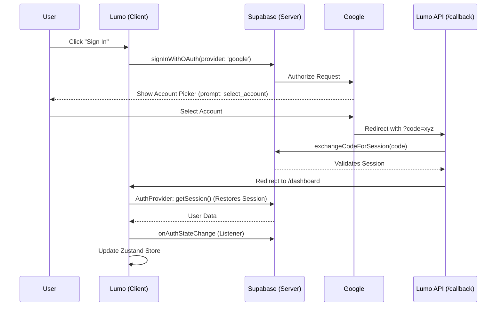

# Authentication (Supabase & Google)

Lumo uses **Supabase Auth** with a **Google-only** OAuth flow. This guide covers the implementation details and configuration specific to Lumo. For general information, refer to the [Official Supabase Google Auth Documentation](https://supabase.com/docs/guides/auth/social-login/auth-google).

---

## The Auth Flow

*Edit this diagram in the [Mermaid Live Editor](https://mermaid.live)*



---

## Configuration Guidelines

### 1. Google Cloud Console
- **Project**: Create/Select a project in [Google Cloud Console](https://console.cloud.google.com/).
- **Authorized redirect URIs**: You must whitelist the Supabase callback URL.
  - **Development**: `https://[YOUR_PROJECT_ID].supabase.co/auth/v1/callback`
  - **Production**: Ensure the same project (or a dedicated production one) has this URI whitelisted. *Google requires the Supabase URL, not your domain.*
- **Publishing Status**: In the "OAuth consent screen" tab, you must click **"Publish App"** to move from *Testing* to *Production*. 
  - *Testing mode* restricts logins to white-listed "Test users" only.
  - *Production mode* allows any Google user to log in (within the unverified limit).

### 2. Supabase Dashboard
- **Authentication > Providers**: Enable Google.
  - Insert `Client ID` and `Client Secret` from Google Cloud.
- **Authentication > URL Configuration**:
  - **Site URL**: 
    - Development: `http://localhost:3000`
    - Production: `https://www.lumo.homes`
  - **Redirect URIs**: 
    - Add `http://localhost:3000/api/auth/callback` for local testing.
    - Add `https://www.lumo.homes/api/auth/callback` for production.

### 3. Environment Variables
Ensure these vary between your environment:
- **Local (`.env.local`)**: Uses your development project keys.
- **Production (Vercel)**: Uses your production project keys.
```bash
NEXT_PUBLIC_SUPABASE_URL=...
NEXT_PUBLIC_SUPABASE_PUBLISHABLE_DEFAULT_KEY=...
```

---

## Key Behaviors

### Account Switching
We use `prompt: 'select_account'` in the OAuth options. This ensures that even if a user is already logged into Google, they are shown the selection screen, allowing them to switch accounts or login with a different email.

### Session Persistence
Auth is session-based and persists via browser cookies.
- **Sign Out**: Clears Lumo cookies but **does not** log the user out of Google.
- **Sign In**: The Google account selection screen will always be shown (even if previously authorized) due to the `prompt: 'select_account'` configuration. This ensures users can always choose or switch accounts.

### Real-Time Sync
The `AuthProvider` (`components/dashboard/auth/auth-provider.tsx`) acts as the "heartbeat":
- **On Mount**: Checks for an existing session via `getSession()`.
- **On Change**: Listens for any state shifts (login, logout, token refresh) via `onAuthStateChange` and updates the global Zustand store instantly.

---

## Structure
All auth logic is colocated in `components/dashboard/auth/`:
- `store.ts`: Zustand state (user, loading).
- `use-auth.ts`: Hook providing `signInWithGoogle` and `signOut`.
- `auth-provider.tsx`: Root-level listener for the dashboard.
- `index.ts`: Public API for the feature.
