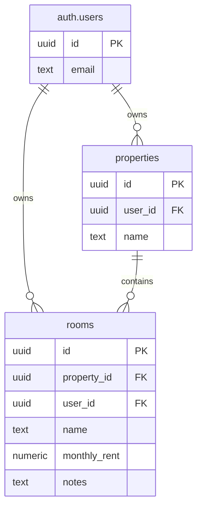

# Database Schema

This document outlines the database structure and relationships within Lumo.

## Entity Relationship Diagram

*Edit this diagram in the [Mermaid Live Editor](https://mermaid.live)*

## Tables

### `properties`

Stores information about properties managed by landlords.

| Key | Column | Type | Description |
| :--- | :--- | :--- | :--- |
| `PK` | `id` | `uuid` | Primary Key (Default: `gen_random_uuid()`) |
| `FK` | `user_id` | `uuid` | Foreign Key to `auth.users(id)`. |
| | `name` | `text` | The display name of the property. |

### `rooms`

Stores information about rooms within properties.

| Key | Column | Type | Description |
| :--- | :--- | :--- | :--- |
| `PK` | `id` | `uuid` | Primary Key (Default: `gen_random_uuid()`) |
| `FK` | `property_id` | `uuid` | Foreign Key to `properties(id)`. Cascades on delete. |
| `FK` | `user_id` | `uuid` | Foreign Key to `auth.users(id)`. |
| | `name` | `text` | The display name of the room. |
| | `monthly_rent` | `numeric` | Optional monthly rent amount for the room. |
| | `notes` | `text` | Optional additional notes about the room. |

## Row Level Security (RLS)

All tables strictly enforce RLS policies to ensure user data isolation. Access is typically scoped to `auth.uid() = user_id`.

For more details on security, see the [Authentication Guide](./auth.md).
